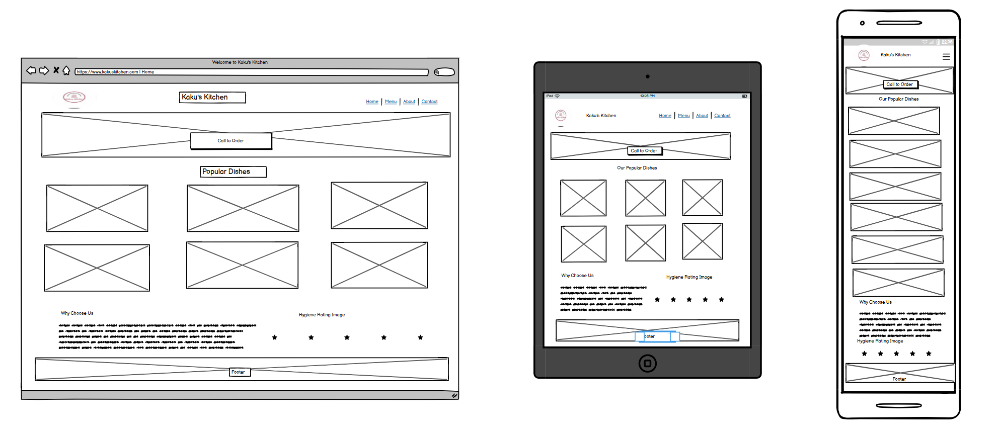
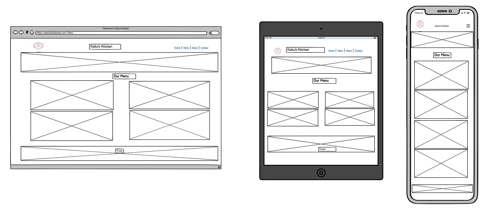
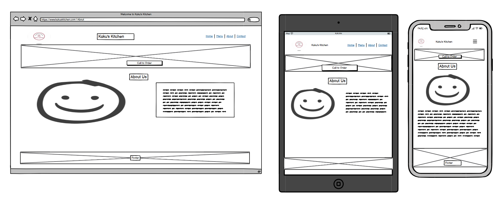
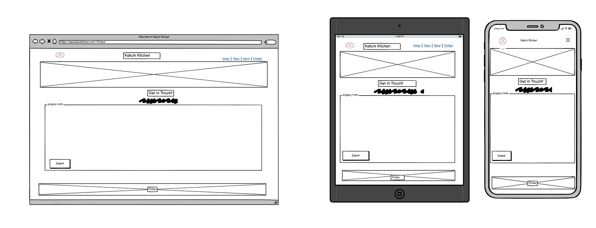
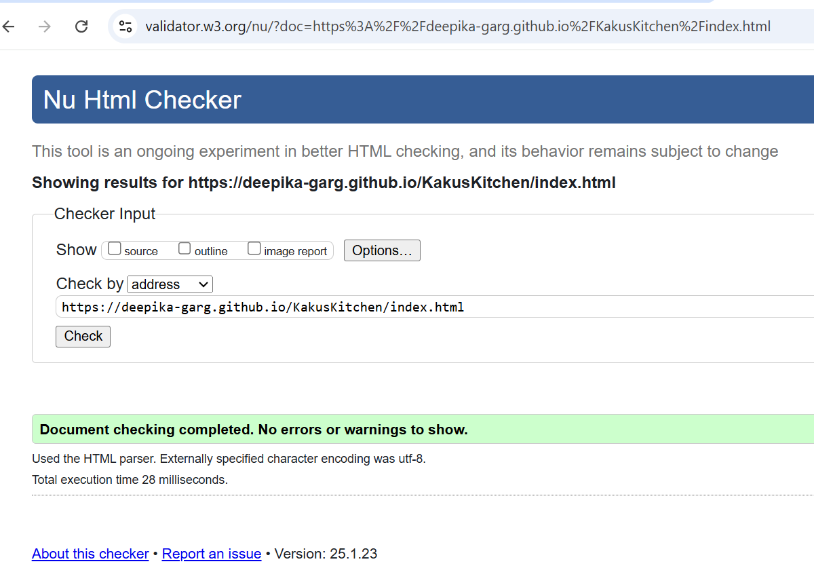

# Kaku's Kitchen

Kaku's Kitchen is a 100% Indian vegetarian cloud kitchen based in Penarth, established in 2020. Renowned for its authentic flavors and dedication to vegetarian cuisine, Kaku's Kitchen serves a variety of delicious homemade Indian dishes made with love and care. This project is a four-page website designed to showcase the essence of Kaku's Kitchen, featuring a menu, a contact page, and information about the kitchen's story and philosophy.

Deployed via GitHub Pages, this responsive website offers a delightful browsing experience and highlights the charm of authentic Indian vegetarian food.

## Table of content

 1. [Planning](#Planning)
    * [Target Audiences](#Target-Audiences)
    * [User Stories](#User-Stories)
    * [Aims](#Aims)
    * [How to achieve this](#How-to-achieve-this)
 2. [Features](#Features)
    * [Navigation Bar](#Navigation-Bar)
    * [Home Page](#Home-Page)
    * [Menu](#Menu)
    * [About Us](#About-Us)
    * [Contact](#Contact)
    * [Call To Order](#Call-To-Order)
    * [Footer](#Footer)
 4. [ColourScheme](#Colour-scheme)
 5. [Final Design](#Final-Design)
 6. [Deployment](#Deployment)
    * [Repository](#Repository)
    * [Hosting](#Hosting)
 7. [Testing](#Testing)
    * [Mobile](#Mobile)
    * [Desktop](#Desktop)
 8. [DeBugging](#DeBugging)
 9. [Technologies Used](#Technologies-Used)
    * [Languages](#Languages)
    * [Technology](#Technology)
 10. [Project Link](#Projectlink)
 11. [Acknowledgments / Thank You's](#Acknowledgments/thanksyou's)

   
 ## Planning
This website was designed with careful consideration of its purpose, target audience, and user needs. The goal was to create a visually appealing, responsive, and user-friendly platform to showcase the authentic Indian vegetarian cuisine offered by Kaku's Kitchen.

### Target Audiences
1. **Vegetarian Food Enthusiasts**:
   - Individuals looking for authentic, homemade Indian vegetarian dishes that capture the essence of traditional Indian cuisine.
   
2. **Cultural Food Lovers**:
   - Food enthusiasts seeking to explore the rich flavors and traditions of Indian vegetarian food.

3. **Vegetarian Working Couples**:
   - Busy working couples who prefer a healthy, home-cooked alternative to eating out regularly but want the convenience of prepared meals.

4. **University Students**:
   - Students living away from home who are vegetarians and need affordable, healthy meal options. Kaku's Kitchen offers a perfect solution for students missing home-cooked meals.

   
### User Stories
1. **As a First-Time Customer**:
   - I want to speak directly with Kaku's Kitchen to understand the ordering process and place an order for tomorrow to ensure I’m prepared in advance.
   - I want to navigate the website easily and find out about the menu and eating option. 
   - I want to know about either it is collection or delievery.

2. **As a Returning Customer**:
   - I want to place an order for my favorite dishes a day in advance so that I can avoid missing out due to high demand.

3. **As a Customer Hosting a Gathering**:
   - I want to call a day in advance to confirm the availability of dishes for a planned gathering so that I can finalize my event preparations.

4. **As a Busy Professional**:
   - I want the option to schedule an order in advance via the "Call to Order" feature so that I can focus on my work without worrying about meals on the day.

   
### Aims
- To create a visually appealing, easy-to-navigate website that reflects the warmth and authenticity of Kaku's Kitchen.
- To provide detailed information about the menu and highlight the 100% vegetarian commitment.
- To make it simple for users to contact Kaku's Kitchen and place orders.
- To increase awareness of the cloud kitchen in the local community.
- To ensure the site is responsive and accessible across all devices.

   
## How to achieve this
1. **User-Centered Design**:
   - Created a simple, intuitive layout with clear navigation to make it easy for users to explore the site.
   
2. **Content Focus**:
   - Highlighted key information such as the menu, contact details, and the story of Kaku's Kitchen prominently.

3. **Responsive Design**:
   - Used HTML, CSS and Bootstrap to ensure the website works seamlessly on desktops, tablets, and mobile devices.

4. **Visual Appeal**:
   - Incorporated warm colors, high-quality images of food, and an inviting design to capture the essence of Kaku's Kitchen.

5. **Fast Deployment**:
   - Deployed the site on GitHub Pages for easy access and updates. 

 ### Wireframes

 ### Home Page - 

### Menu Page -

### About Page-

### Contact Page-

### Success Page-

Reason for design - I went with a basic yet responsive design that will be inviting to all users of the website aswell as giving out all the relevent information.

## Features 

### Navigation Bar
  

### About Us 

### What we Offer

### CallBack

### Footer
  
 
## Colour Scheme

## Final Design

## Deployment

### Repository

### Hosting

## Testing

### Mobile

### Desktop

## DeBugging

### Home Page -

### Menu Page -

### About Page -

### Contact Page -

### CSS - 

## Technologies Used

### Languages

### Technology
*

## Project Link

## Acknowledgments / Thank you's

Kaku's Kitchen website was built using the below sources

 * Code insitute - Inspiration from Love Running & Boaredwalk projects 
 * [Favicon from icons8](https://icons8.com/)
 * [Font awesome](https://fontawesome.com/)
 * [Bootstrap for custom button](https://getbootstrap.com/)