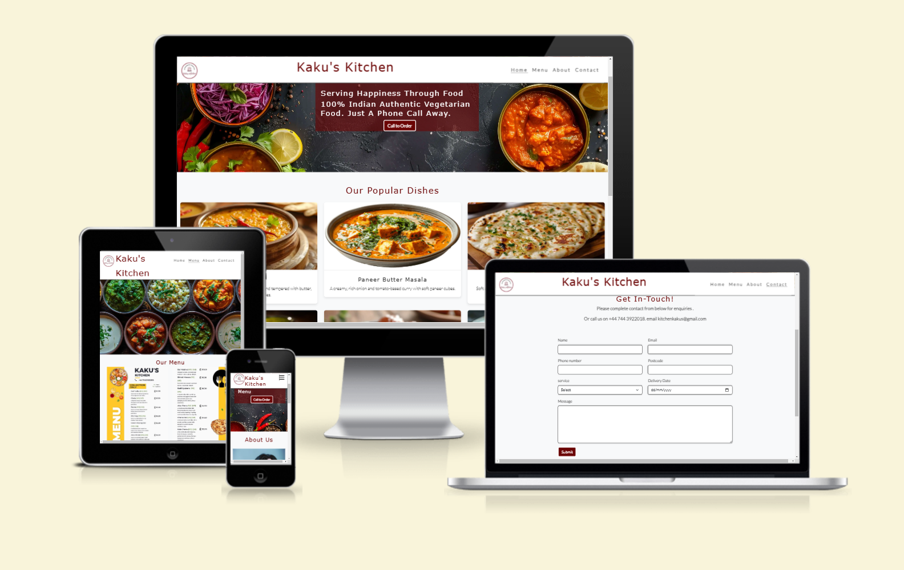
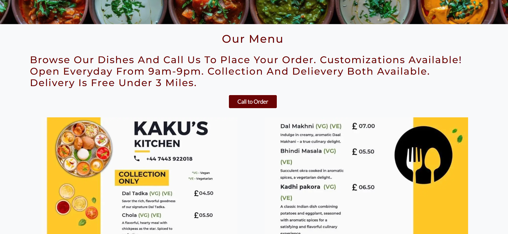
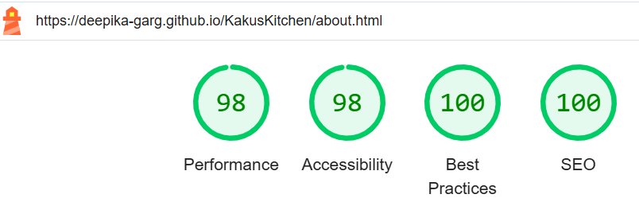

# Kaku's Kitchen

Kaku's Kitchen is a 100% Indian vegetarian cloud kitchen based in Penarth, established in 2020. Renowned for its authentic flavors and dedication to vegetarian cuisine, Kaku's Kitchen serves a variety of delicious homemade Indian dishes made with love and care. This project is a four-page website designed to showcase the essence of Kaku's Kitchen, featuring a menu, a contact page, and information about the kitchen's story and philosophy.

Deployed via GitHub Pages, this responsive website offers a delightful browsing experience and highlights the charm of authentic Indian vegetarian food.

## Table of content

 1. [Planning](#Planning)
    * [Target Audiences](#Target-Audiences)
    * [User Stories](#User-Stories)
    * [Aims](#Aims)
    * [How to achieve this](#How-to-achieve-this)
 2. [Features](#Features)
    * [Favicons](#Favicons)
    * [Navigation Bar](#Navigation-Bar)
    * [Popular Dishes](#Popular-Dishes)
    * [Why Choose Us](#Why-Choose-Us)
    * [Menu](#Menu)
    * [About Us](#About-Us)
    * [Contact](#Contact)
    * [Call To Order](#Call-To-Order)
    * [Footer](#Footer)
 4. [ColourScheme](#Colour-scheme)
 5. [Final Design](#Final-Design)
 6. [Deployment](#Deployment)
 7. [Testing](#Testing)
    * [AUTOMATED TESTING](#automated-testing)
      * [W3C Validator](#w3c-validator)
      * [Lighthouse](#lighthouse)
    * [MANUAL TESTING](#manual-testing)
      * [Testing User Stories](#testing-user-stories)
      * [Manual Link Testing](#manual-link-testing)
      * [Real World Testing](#real-world-testing)
 8. [DeBugging](#DeBugging)
 9. [Technologies Used](#Technologies-Used)
    * [Languages](#Languages)
    * [Technology](#Technology)
 10. [Project Link](#Projectlink)
 11. [Acknowledgments / Thank You's](#Acknowledgments/thanksyou's)

   
 ## Planning
This website was designed with careful consideration of its purpose, target audience, and user needs. The goal was to create a visually appealing, responsive, and user-friendly platform to showcase the authentic Indian vegetarian cuisine offered by Kaku's Kitchen.

### Target Audiences
1. **Vegetarian Food Enthusiasts**:
   - Individuals looking for authentic, homemade Indian vegetarian dishes that capture the essence of traditional Indian cuisine.
   
2. **Cultural Food Lovers**:
   - Food enthusiasts seeking to explore the rich flavors and traditions of Indian vegetarian food.

3. **Vegetarian Working Couples**:
   - Busy working couples who prefer a healthy, home-cooked alternative to eating out regularly but want the convenience of prepared meals.

4. **University Students**:
   - Students living away from home who are vegetarians and need affordable, healthy meal options. Kaku's Kitchen offers a perfect solution for students missing home-cooked meals.

   
### User Stories
1. **As a First-Time Customer**:
   - I want to speak directly with Kaku's Kitchen to understand the ordering process and place an order for tomorrow to ensure I’m prepared in advance.
   - I want to navigate the website easily and find out about the menu and eating option. 
   - I want to know about either it is collection or delievery.

2. **As a Returning Customer**:
   - I want to place an order for my favorite dishes a day in advance so that I can avoid missing out due to high demand.

3. **As a Customer Hosting a Gathering**:
   - I want to call a day in advance to confirm the availability of dishes for a planned gathering so that I can finalize my event preparations.

4. **As a Busy Professional**:
   - I want the option to schedule an order in advance via the "Call to Order" feature so that I can focus on my work without worrying about meals on the day.

   
### Aims
- To create a visually appealing, easy-to-navigate website that reflects the warmth and authenticity of Kaku's Kitchen.
- To provide detailed information about the menu and highlight the 100% vegetarian commitment.
- To make it simple for users to contact Kaku's Kitchen and place orders.
- To increase awareness of the cloud kitchen in the local community.
- To ensure the site is responsive and accessible across all devices.

   
## How to achieve this
1. **User-Centered Design**:
   - Created a simple, intuitive layout with clear navigation to make it easy for users to explore the site.
   
2. **Content Focus**:
   - Highlighted key information such as the menu, contact details, and the story of Kaku's Kitchen prominently.

3. **Responsive Design**:
   - Used HTML, CSS and Bootstrap to ensure the website works seamlessly on desktops, tablets, and mobile devices.

4. **Visual Appeal**:
   - Incorporated warm colors, high-quality images of food, and an inviting design to capture the essence of Kaku's Kitchen.

5. **Fast Deployment**:
   - Deployed the site on GitHub Pages for easy access and updates. 

 ### Wireframes

 ### Home Page - 

### Menu Page -

### About Page-

### Contact Page-

### Success Page-

Reason for design - I went with a basic yet responsive design that will be inviting to all users of the website aswell as giving out all the relevent information.

## Features 

### Favicon
Favicon is added in the header of every page with the title.

### Navigation Bar
Navigation bar is located at the top of every page, contains links to all the pages of the site to enable ease of navigation in one convenient location. it is fully responsive for all the devices as laptop, desktop, mobile and tablet. 
The logo is clickable with a link back to the home page for enhanced UX. 

Desktop: 

Mobile:
Navigation menu is converted to three vertical bars to save the space. which shows its responsiveness.

### Footer
* Footer is available on each page and contain address, Email and phone no details along with social media links for Kaku's Kitchen. These links will open in a new tab for easy navigation for the user.
* The footer is designed to encourage the user to visit Kaku's Kitchen's social media sites to keep them connected and have the most up to date information.

### Call TO Order
 Call to Order button is provided in the hero/header section for convenience. User can quickly make a call and place order just by clicking that button. This button is connected with the contact information in the footer at the moment.

 

### Popular Dishes

Popular dishes images are added in the main section of home page. Images are high quality to make user tempting to buy food. hoover effect are added for better user experience.

### Why Choose Us

I have added 5 star rating for user assurance and given reasons to choose the cloud kitchen.

### Menu
Easy to read / navigate menu images are used. Prices and ingredients are clearly mentioned with individual food item. Phone number is mentioned in every menu card to make a quick call and place a order. 

### About Us 

### contact
Contact page contain a hero image same as home page and about page. In the main section Form has been added on the contact page, where all the validations has been applied.

  
 
## Colour Scheme
rgb(107, 4, 4);
#3a3a3a;
 #f8f9fa;
  #ffffff;
  #fff;
   #333;
   #666;
  #000000;
   #28a745;

## Final Design

## Deployment

This site was deployed through GitHub Pages using the following steps:

Log into GitHub.
Locate the repository. In my case it is Deepika-Garg/Kaku's Kitchen
Click the "settings" button.
Then go to "Pages" tab in the left hand side sidebar.
Once on the pages site I would ensure the following settings were applied;
	Source would need to be set to ‘Deploy from branch’
	Branch will need to be set to main and then root. 
Click the save button.
The site has now been deployed, please note that this process may take a few minutes before the site goes live.
The page will update and at the top it will say: "Your site is ready to be published at
 https://deepika-garg.github.io/KakusKitchen/

### Local Development
How to Fork
To fork the repository:

Log in (or sign up) to Github.
Go to the repository for this project, Deepika-Garg/Kaku's Kitchen
Click the Fork button in the top right corner.

How to Clone
To clone the repository:

1. Log in (or sign up) to GitHub.
2. Go to the repository for this project, Deepika-Garg/Kaku's Kitchen
3. Click on the code button, select whether you would like to clone with HTTPS, SSH or GitHub CLI and copy the link shown.
4. Open the terminal in your code editor and change the current working directory to the location you want to use for the cloned Directory.
5. Type 'git clone' into the terminal and then paste the link you copied in step 3. Press enter.

## Testing

I tested my site throughout the entire build. I have gone through each page using google chrome developer tools to ensure that each page is responsive on different screen sizes and devices and troubleshoot any issues as I went along.
- - -

## AUTOMATED TESTING

### W3C Validator

[W3C](https://validator.w3.org/) was used to validate the HTML on all pages of the website. It was also used to validate the CSS.

### HTML- 

### CSS - 
css Validation

### Lighthouse

I used Lighthouse within the Chrome Developer Tools to test the performance, accessibility, best practices and SEO of the website.

### Desktop Results

All pages of the site are achieving a score of above 90 or better across the 4 categories.

### Mobile Results

All pages of the site on mobile devices are achieving a score of 91 or better across the 4 categories.

- - -

## MANUAL TESTING

### Testing User Stories

`First Time Customer`

| Goals | Actions |
| :--- | :--- |

## DeBugging

### Home Page -

### Menu Page -

### About Page -

### Contact Page -

## Technologies Used

### Languages
Languages Used
HTML - To create a basic site.
CSS - To create a nice style and to stand-out.

## Technologies Used

### Frameworks, Libraries & Programs Used

[Balsamiq](https://balsamiq.com/) - Used to create wireframes.

[Github](https://github.com/) - To save and store the files for the website.

[Google Fonts](https://fonts.google.com/) - To import the fonts used on the website.

[Font Awesome](https://fontawesome.com/) - For the iconography on the website.

[Bootstrap Version 5](https://getbootstrap.com/) - The framework for the website. Code for the navigation bar, carousel, cards and form were used and modified. Additional CSS styling was also implemented in style.css.

[Favicon.io](https://favicon.io/) To create favicon.

[StockAdobe]()

[Compressor](https://compressor.io/) To compress images.

[Am I Responsive?](http://ami.responsivedesign.is/) To show the website image on a range of devices.

[Webaim](https://wave.webaim.org/) to test accesibility of the deployed website.

Google Dev Tools - To troubleshoot and test features, solve issues with responsiveness and styling.
Visual Studio Code is used as an editor to write code.

## Project Link

## Acknowledgments / Thank you's

Kaku's Kitchen website was built using the below sources

 * Code insitute - Inspiration from Love Running & Boaredwalk projects 
 * [Favicon from icons8](https://icons8.com/)
 * [Font awesome](https://fontawesome.com/)
 * [Bootstrap for custom button](https://getbootstrap.com/)