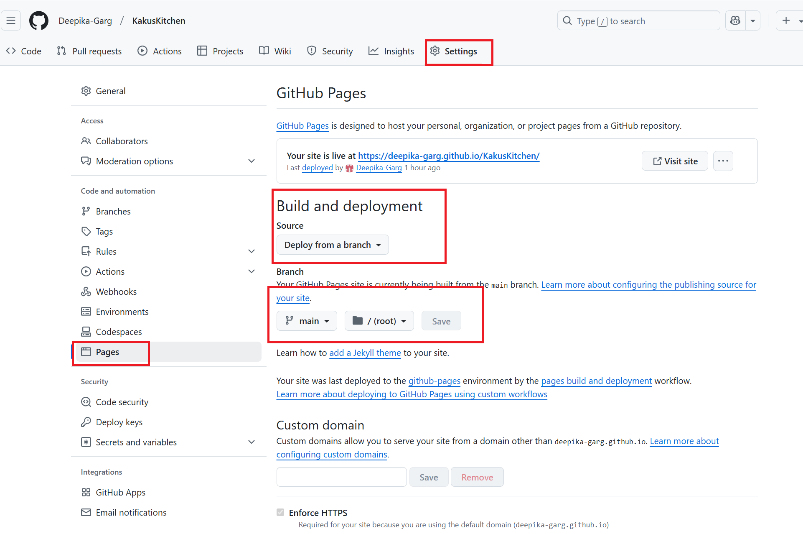

# Kaku's Kitchen

Kaku's Kitchen is a 100% Indian vegetarian cloud kitchen based in Penarth, established in 2020. Renowned for its authentic flavors and dedication to vegetarian cuisine, Kaku's Kitchen serves a variety of delicious homemade Indian dishes made with love and care. This project is a four main pages website designed to showcase the essence of Kaku's Kitchen, featuring a menu, a contact page, and information about the kitchen's story and philosophy. Fifth page is a success page or Thank you page in continuation with the contact page form submission.

Deployed via GitHub Pages, this responsive website offers a delightful browsing experience and highlights the charm of authentic Indian vegetarian food.

 site :  <a href="https://deepika-garg.github.io/KakusKitchen/index.html" target="_blank" rel="noopener">Kaku's Kitchen</a>

## Table of content

 1. [Planning](#Planning)
    * [Target Audiences](#Target-Audiences)
    * [User Stories](#User-Stories)
    * [Aims](#Aims)
    * [Actions](#Actions)
 2. [Design](#Design)
      * [Wireframes](#Wireframes)
      * [ColourScheme](#Colour-scheme)
      * [Typography](#Typography)
      * [Imagery](#imagery)   
 3. [Existing Features](#Existing-Features)
    * [Favicon](#Favicon)
    * [Navigation Bar](#Navigation-Bar)
    * [Popular Dishes](#Popular-Dishes)
    * [Why Choose Us](#Why-Choose-Us)
    * [Menu](#Menu)
    * [About Us](#About-Us)
    * [Contact](#Contact)
    * [Call To Order](#Call-To-Order)
    * [Footer](#Footer)
 4. [Future Features](#Future-Features)
 5. [Technologies Used](#Technologies-Used)
    * [Languages](#Languages)
    * [Technology](#Technology)
 6. [Final Design](#Final-Design)
 7. [Deployment](#Deployment)
 8. [Testing](#Testing)
 9. [Credit](#Credit)
      * [Media](#media)
      * [Acknowledgments / Thank You's](#Acknowledgments/thanksyou's)

   
 ## Planning
This website was designed with careful consideration of its purpose, target audience, and user needs. The goal was to create a visually appealing, responsive, and user-friendly platform to showcase the authentic Indian vegetarian cuisine offered by Kaku's Kitchen.

### Target Audiences
1. **Vegetarian Food Enthusiasts**:
   - Individuals looking for authentic, homemade Indian vegetarian dishes that capture the essence of traditional Indian cuisine.
   
2. **Cultural Food Lovers**:
   - Food enthusiasts seeking to explore the rich flavors and traditions of Indian vegetarian food.

3. **Vegetarian Working Couples**:
   - Busy working couples who prefer a healthy, home-cooked alternative to eating out regularly but want the convenience of prepared meals.

4. **University Students**:
   - Students living away from home who are vegetarians and need affordable, healthy meal options. Kaku's Kitchen offers a perfect solution for students missing home-cooked meals.

[Back to top](#Table-of-content)
   
### User Stories
1. **As a First-Time Customer**:
   - I want to navigate the website easily and find out about the menu and eating option. 
   - As it is a call to order style business as a new customer I want to speak directly with Kaku's Kitchen to understand the ordering process and place an order.
   - I want to know about either it is collection or delievery. 

2. **As a Returning Customer**:
   - I want to place an order for my favorite dishes a day in advance so that I can avoid missing out due to high demand.

3. **As a Customer Hosting a Gathering**:
   - I want to call a day in advance to confirm the availability of dishes for a planned gathering so that I can finalize my event preparations.

4. **As a Busy Professional**:
   - I want the option to schedule an order in advance via the "Call to Order" feature so that I can focus on my work without worrying about meals on the day.

[Back to top](#Table-of-content)
   
### Aims
- To create a visually appealing, easy-to-navigate website that reflects the warmth and authenticity of Kaku's Kitchen.
- To provide detailed information about the menu and highlight the 100% vegetarian commitment.
- To make it simple for users to contact Kaku's Kitchen and place orders.
- To increase awareness of the cloud kitchen in the local community.
- To ensure the site is responsive and accessible across all devices.

 [Back to top](#Table-of-content)  

## Actions
1. **User-Centered Design**:
   - Created a simple, intuitive layout with clear navigation to make it easy for users to explore the site.
   
2. **Content Focus**:
   - Highlighted key information such as the menu, contact details, and the story of Kaku's Kitchen prominently.

3. **Responsive Design**:
   - Used HTML, CSS and Bootstrap to ensure the website works seamlessly on desktops, tablets, and mobile devices.

4. **Visual Appeal**:
   - Incorporated warm colors, high-quality images of food, and an inviting design to capture the essence of Kaku's Kitchen.

5. **Fast Deployment**:
   - Deployed the site on GitHub Pages for easy access and updates. 

   [Back to top](#Table-of-content)

## Design

 ### Wireframes

 #### Home Page - 

#### Menu Page -

#### About Page-

#### Contact Page-

[Back to top](#Table-of-content)

### Colour Scheme
Very less colors are used so that focus remains on images. [Color Adobe](https://color.adobe.com/) to create the color pallete. contrast of color is good.

[Back to top](#Table-of-content)

### Typography
The font-families chosen are montserrat and Lora. For consistency I used montserrat for headings and titles and Lora was used for the text on the body and cards body.

[Back to top](#Table-of-content)

### Imagery
Imagery plays a very important part in the design for this website. I chose bright colourful tempting food images that complimented each other on the page. I added a hoover effect on the images of home page to give it more life. Images are taken from [StockAdobe](https://stock.adobe.com/uk/). Images on the menu page are taken from the actual business called Kaku's Kitchen, based in Penarth. 

Reason for design - I went with a basic yet responsive design that will be inviting to all users of the website aswell as giving out all the relevent information.

[Back to top](#Table-of-content)

## Existing Features 

### Favicon
Favicon is added in the header of every page with the title.

[Back to top](#Table-of-content)

### Navigation Bar
Navigation bar is located at the top of every page, contains links to all the pages of the site to enable ease of navigation in one convenient location. it is fully responsive for all the devices as laptop, desktop, mobile and tablet. 
The logo is clickable with a link back to the home page for enhanced UX. 

Desktop: 

Mobile:

Navigation menu is converted to three vertical bars to save the space. which shows its responsiveness.

[Back to top](#Table-of-content)

### Footer
* Footer is available on each page and contain address, Email and phone no details along with social media links for Kaku's Kitchen. These links will open in a new tab for easy navigation for the user.
* The footer is designed to encourage the user to visit Kaku's Kitchen's social media sites to keep them connected and have the most up to date information.

[Back to top](#Table-of-content)

### Call TO Order
 Call to Order button is provided in the hero/header section for convenience. User can quickly make a call and place order just by clicking that button. This button is connected with the contact information in the footer at the moment.

 

 [Back to top](#Table-of-content)

### Popular Dishes

Popular dishes images are added in the main section of home page. Images are high quality to make user tempting to buy food. hoover effect are added for better user experience.

[Back to top](#Table-of-content)

### Why Choose Us

I have added 5 star rating for user assurance and given reasons to choose the cloud kitchen.

[Back to top](#Table-of-content)

### Menu
Easy to read / navigate menu images are used. Prices and ingredients are clearly mentioned with individual food item. Phone number is mentioned in every menu card to make a quick call and place a order. 

[Back to top](#Table-of-content)

### About Us 
Mission and history is provided in about section.

[Back to top](#Table-of-content)

### contact
Contact page contain a hero image same as home page and about page. In the main section Form has been added on the contact page, where all the validations has been applied.

[Back to top](#Table-of-content)

## Future Features
* Call to order / Call to action button must make a call to the business phone number.
* in the contact page st click of form submit button there must be notification to the business with all the information provided in the form.
* business should be able to make changes/ add more items in the menu and the prices on regular basis.

[Back to top](#Table-of-content)

## Technologies Used

### Languages
Languages Used
1. HTML - To create a basic site.
2. CSS - To create a nice style and to stand-out.

### Technology 

### Frameworks, Libraries & Programs Used

Kaku's Kitchen website was built using the below sources

Code insitute - Inspiration from Love Running & Boaredwalk projects 

[Balsamiq](https://balsamiq.com/) - Used to create wireframes.

[Github](https://github.com/) - To save and store the files for the website.

[Google Fonts](https://fonts.google.com/) - To import the fonts used on the website.

[Font Awesome](https://fontawesome.com/) - For the iconography on the website.

[Bootstrap Version 5](https://getbootstrap.com/) - The framework for the website. Code for the navigation bar, carousel, cards and form were used and modified. Additional CSS styling was also implemented in style.css.

[Favicon.io](https://favicon.io/) To create favicon.

[Color Adobe](https://color.adobe.com/)  To create the color pallete

[StockAdobe](https://stock.adobe.com/uk/) - All the images are borrowed from Stock Adobe.

[Image Resizer](https://imageresizer.com/)- For resizing images and compress them.

[Compressor](https://compressor.io/) - To compress images.

[Convertio](https://convertio.co/) - To covert images to WebP format. 

[Am I Responsive?](http://ami.responsivedesign.is/) To show the website image on a range of devices.

[Webaim](https://wave.webaim.org/) To test accesibility of the deployed website.

Google Dev Tools - To troubleshoot and test features, solve issues with responsiveness and styling.
Visual Studio Code is used as an editor to write code.

[Back to top](#Table-of-content)

## Final Design
### Home page Responsiveness

### Menu page Responsiveness

### About Page Responsiveness

### Contact page Responsiveness

[Back to top](#Table-of-content)

## Deployment

This site was deployed through GitHub Pages using the following steps:

1. Log into GitHub.
2. Locate the repository. In my case it is Deepika-Garg/Kaku's Kitchen
3. Click the "settings" button.

4. Then go to "Pages" tab in the left hand side sidebar.

5. Once on the pages site I would ensure the following settings were applied
	1.  Source would need to be set to ‘Deploy from branch’
	2.  Branch will need to be set to main and then root. 
6. Click the save button.

The site has now been deployed, please note that this process may take a few minutes before the site goes live.
7. The page will update and at the top it will say: "Your site is ready to be published at
 https://deepika-garg.github.io/KakusKitchen/

[Back to top](#Table-of-content)

### Local Development
#### How to Fork
To fork the repository:

1. Log in (or sign up) to Github.
2. Go to the repository for this project, Deepika-Garg/Kaku's Kitchen
3. Click the Fork button in the top right corner.

#### How to Clone
To clone the repository:

1. Log in (or sign up) to GitHub.
2. Go to the repository for this project, Deepika-Garg/Kaku's Kitchen
3. Click on the code button, select whether you would like to clone with HTTPS, SSH or GitHub CLI and copy the link shown.

4. In your IDE of choice, open 'Git Bash'.
5. Change the current working directory to the location where you want the cloned directory to be made.
6. Type 'git clone' into the terminal and then paste the link you copied in step 3. Press enter.

[Back to top](#Table-of-content)

## Testing

I tested my site throughout the entire build. I have gone through each page using google chrome developer tools to ensure that each page is responsive on different screen sizes and devices and troubleshoot any issues as I went along.

Please refer to [Test Document](TESTING.md) for all information on testing Kaku's Kitchen.

[Back to top](#Table-of-content)

# Credit

## Media

Code insitute - Inspiration from Love Running & Boaredwalk projects 

[Favicon.io](https://favicon.io/) To create favicon.

[StockAdobe](https://stock.adobe.com/uk/) - All the images are borrowed from Stock Adobe.

[Image Resizer](https://imageresizer.com/)- For resizing images and compress them.

[Compressor](https://compressor.io/) - To compress images.

[Convertio](https://convertio.co/) - To covert images to WebP format. 

[Am I Responsive?](http://ami.responsivedesign.is/) To show the website image on a range of devices.

Google Dev Tools - To troubleshoot and test features, solve issues with responsiveness and styling.

Visual Studio Code is used as an editor to write code.

## Acknowledgments / Thank you's

I would like to thank following people for the help and advise they have given me in this project.

* My mentor Precious Ijege for his guidence and feedback throughout this milestone project.
* Marco Tot our class cohort facilitator for his constant assistance and encouragement.
* Slack Community for their endless support.
* Kera Cudmore for telling how to create the structure of Readme [document](https://github.com/kera-cudmore/readme-examples). 
* Code institute for the outstanding course documentation.
* Finally, I would like to thank my friend to allow me to use her business details for this project. 

 [Back to top](#Table-of-content)