# Testing

1. [Testing](#Testing)
    * [Code Validation](#Code-Validation)
      * [W3C Validator](#w3c-validator)
      * [Lighthouse](#lighthouse)
    * [Known Bugs](#Known-bugs)
    * [Manual Testing](#manual-testing)
      * [Testing User Stories](#testing-user-stories)
      * [Manually Link Testing](#manually-link-testing)
      * [Responsiveness Testing](#Responsiveness-testing)
    

## Code Validation

### W3C Validator

<a href="https://validator.w3.org/" target="_blank" rel="noopener" >W3C html Validator</a> was used to validate the HTML on all pages of the website. [W3C CSS Validator](https://jigsaw.w3.org/css-validator/) was also used to validate the CSS.
Minor errors were found which I have described in [Known Bugs](#known-bugs) section. After a fix and retest, no errors were returned.

### HTML-

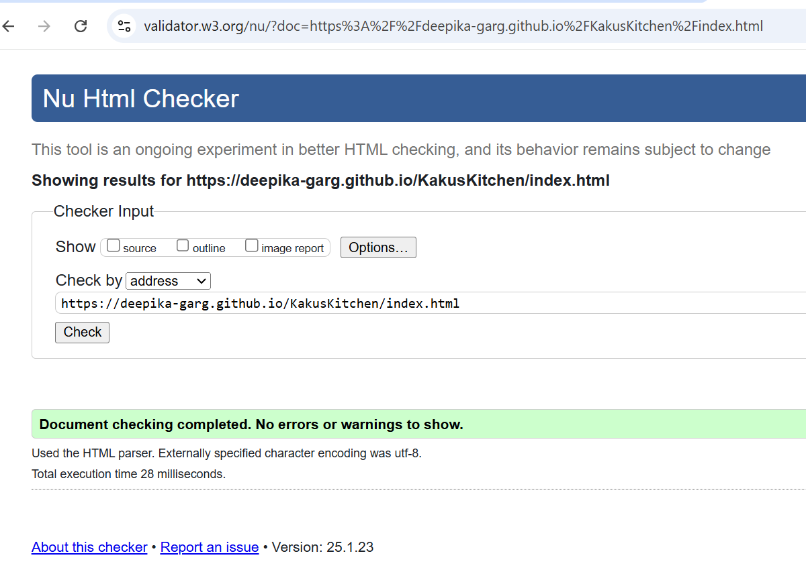 - Passed

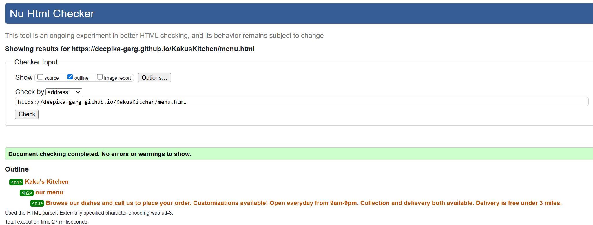 - Passed

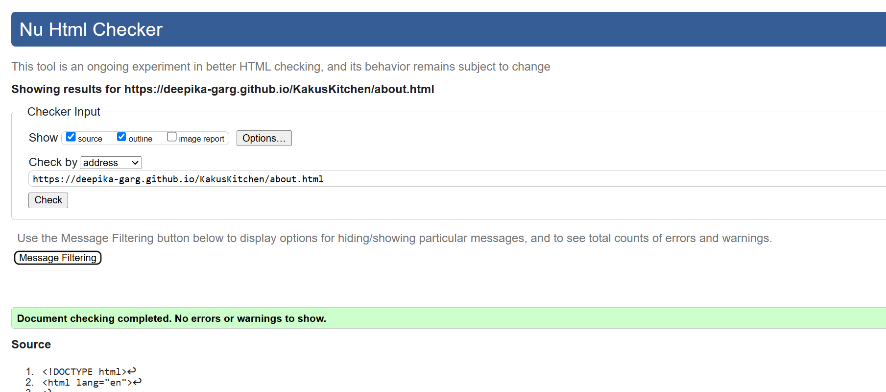 - Passed

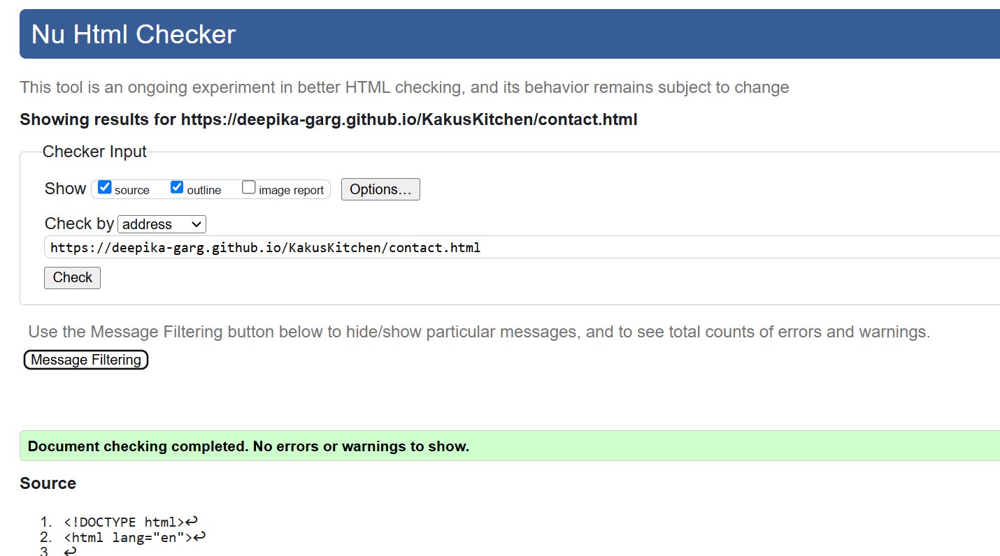 - Passed

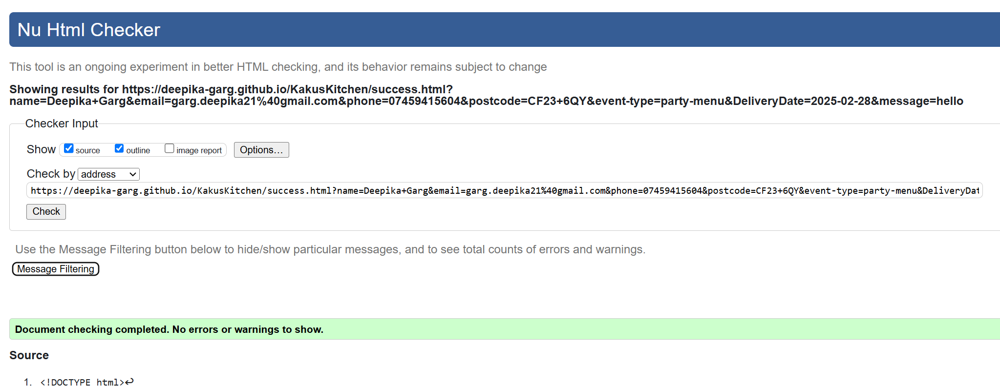 - Passed

### CSS - 
CSS Validation

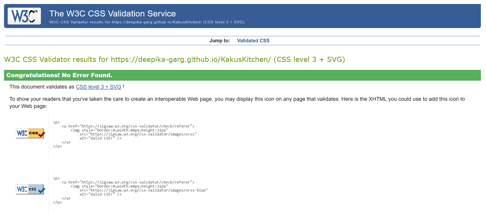 - Passed, No error found.

[Back to top](#Testing)

### Lighthouse

I used Lighthouse within the Chrome Developer Tools to test the performance, accessibility, best practices and SEO of the website.

### Desktop Results

All pages of the site are achieving a score of above 90 or better across the 4 categories.

Home

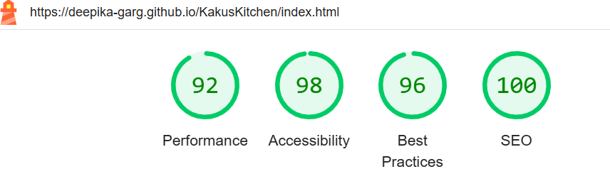

Menu

About

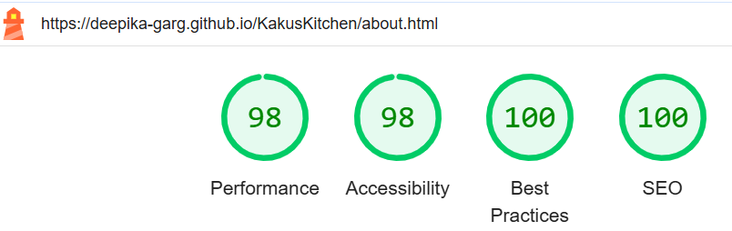

Contact

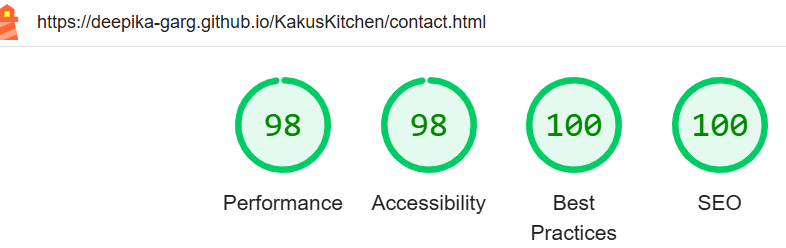

Success

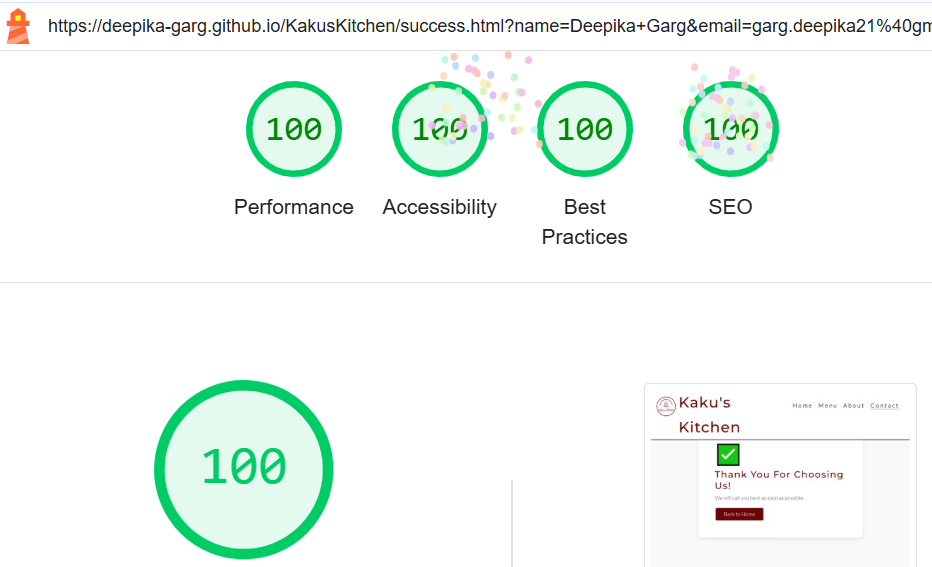

[Back to top](#Testing)

### Mobile Results

All pages of the site on mobile devices are achieving good score across the 4 categories.

Home

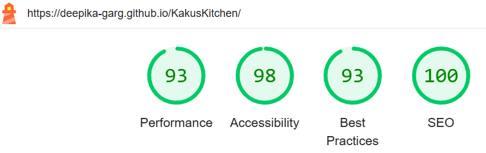

Menu

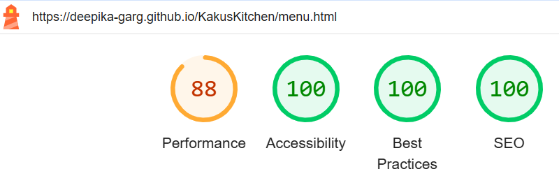

About

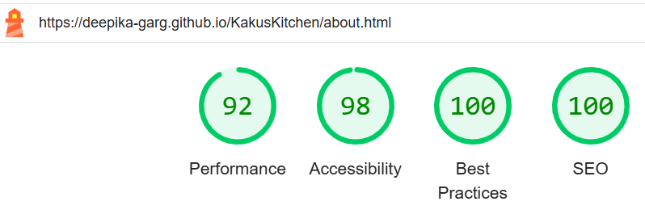

Contact

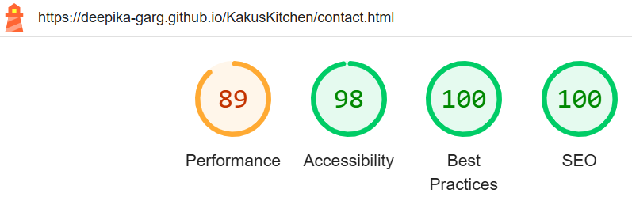

Success

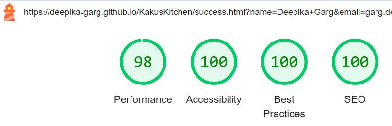

[Back to top](#Testing)

- - -

# Known Bugs

Menu Page 
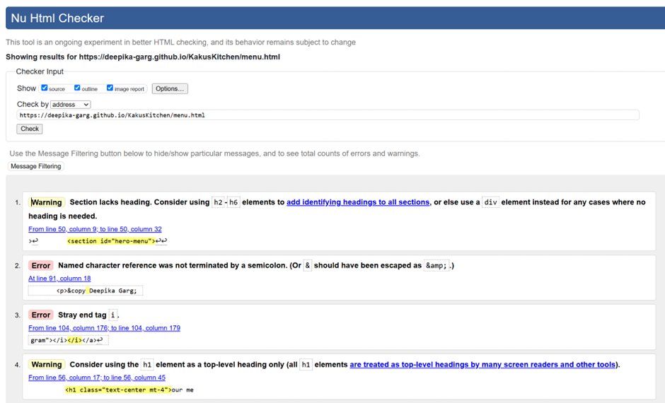
Errors were corrected easily as suggested by validator.

CSS
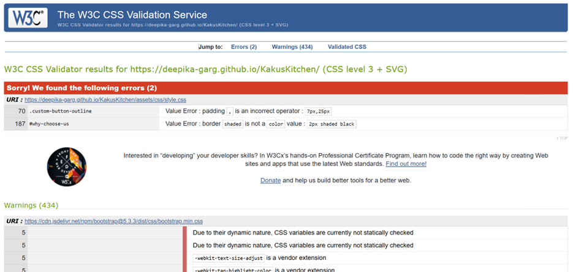
Error was corrected.

* Another bug was images's size. When validated through lighthouse, Performance was really low.
fixes:- I compressed all the images of the website. That's how performance was improved.

## Manual testing

### Testing User Stories

`As a Customer`

| Goals | Actions |
| :--- | :--- |
| As a customer I want to know about the business. What it is and what does it offer.| I mentioned in cover text it is 100% indian vegetarian food cloud kithen. I added a Call to Order button to show it's call to order approach.| 
| As a customer I want to be able to easily navigate the website. | I added a navigation bar to all pages that gives the user an easy way to navigate the website. |
| As a customer I want to be able to easily find the contact details. | I added a footer with basic contact details for the Business. |
| As a customer I want to find out the menu and speciality of the business. | I added a card section on home page with the six popular dishes of Kaku's Kitchen. I have added a full menu offered by Kaku's Kitchen on menu page and navigation bar is on the top of all pages to go menu page.  |

[Back to top](#Testing)

### Manually Link Testing

#### __Global__

- - -
__Navigation bar__

__Expected__

I expect the nav bar to link all the pages together and give easy navigation of the website. On each respective page the navbar will show what page you are on as shown below.

Home page - Home option is underlined to show current page.

Menu page - Menu option is underlined to show current page.

Contact page - Contact option is underlined to show current page.
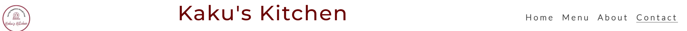

About page - About option is underlined to show current page.
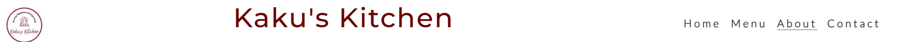

Success page - For success page contact option is highlighted as it is extension of contact page.
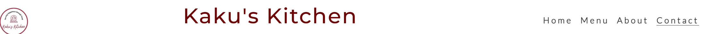

__Results__

The navigation bar on all the pages works as designed and as expected.

- - -
[Back to top](#Testing)

__Footer__

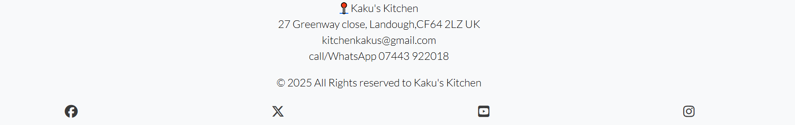

__Expected__

The social media links open up to the respective home page in a new tab. Pinned address will take you to the google map in new tab.

__Results__

Worked as intended.

- - - 
[Back to top](#Testing)

#### __Home Page__

- - -

__Hero call to action button__

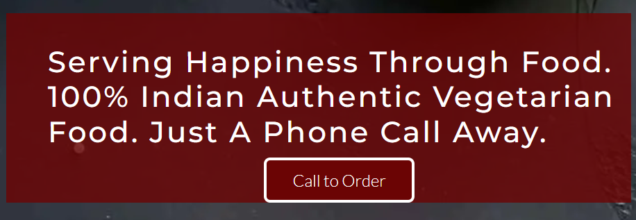
__Expected__

The user will click on the button which will take them to the contact detail in the footer section.

__Results__

The button worked as expected.

- - -
[Back to top](#Testing)

#### __Contact Page__

- - - 

__Form__

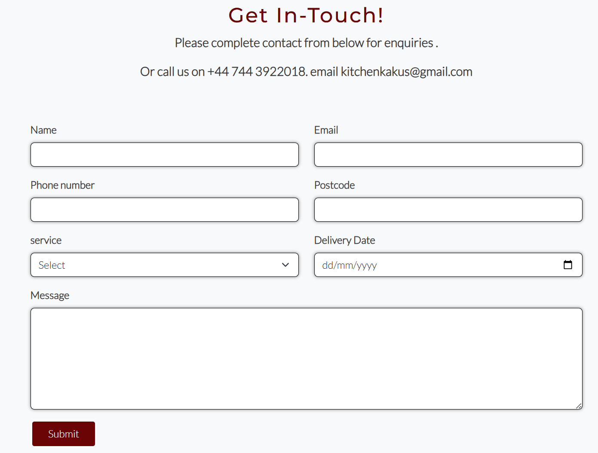

- - -

__Form validation__
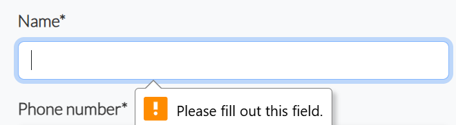

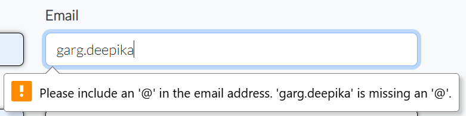

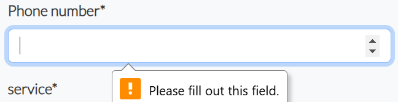

Validation has been checked manually on all the field like above.

Filled form ready to submit. Once you hit the submit button, it will direct you to the Thankyou/Success page. 

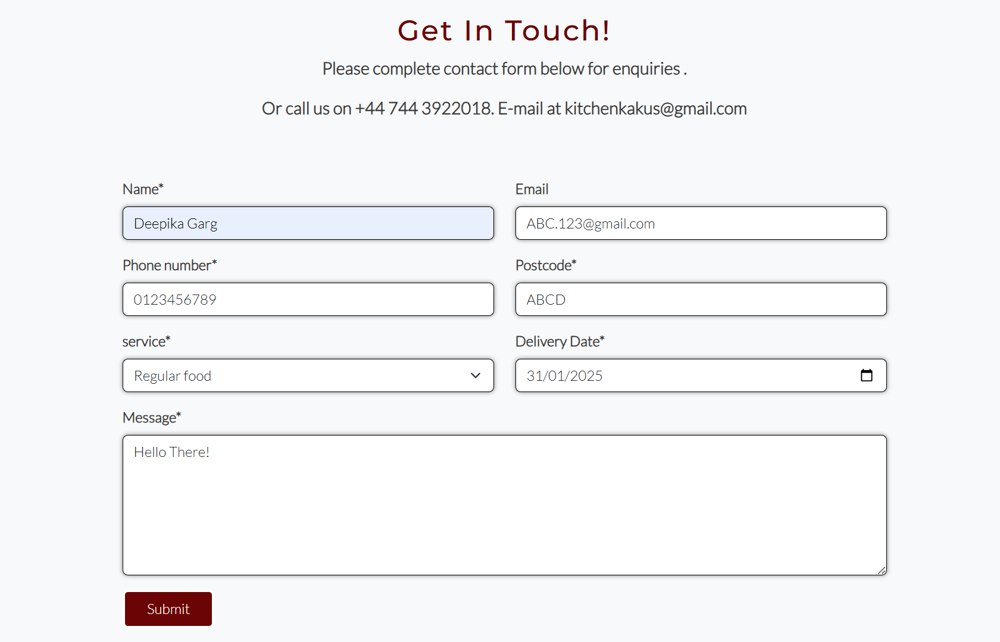

__Results__

Form is working as expected. 

[Back to top](#Testing)

__ThankYou Page__

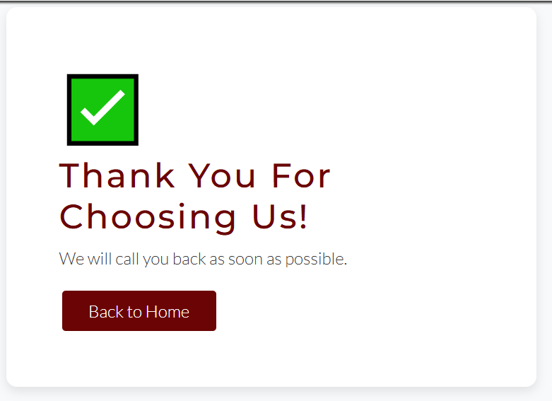

Back to Home button on contact form will take you back to the home page.

__Result__

Success page is working as expected.

[Back to top](#Testing)

## Testing on different devices

## Responsiveness Testing

* The responsive design tests were carried out manually with [Google Chrome DevTools](https://developer.chrome.com/docs/devtools/) and [Am I Responsive](https://ui.dev/amiresponsive?url=https://deepika-garg.github.io/KakusKitchen/).

|        | Galaxy S5 | iPhone 13| iPad | iPhone 15 pro| Laptop <1200px | Display >1200px |
|--------|-----------|----------|------|--------------|-----------------|----------------|
| Render | pass      | pass     | pass | pass         | pass            | pass           |
| Images | pass      | pass     | pass | pass         | pass            | pass           |
| Links  | pass      | pass     | pass | pass         | pass            | pass           |

Note: On wide display types the contents of the site are restricted in width to 2000px. This helps the UX by not spreading the content too wide on the extra wide screens.

## Browser Compatibility

Kaku's Kitchen site was tested on the following browsers with no visible issues for the user. 
Google Chrome, Safari. Appearance, functionality and responsiveness were consistent throughout for a range of device sizes.

## WebAIM 
All the pages are checked and found no errors.

* [Back to top](#Testing)
* Back to [Readme](./README.md#testing)

